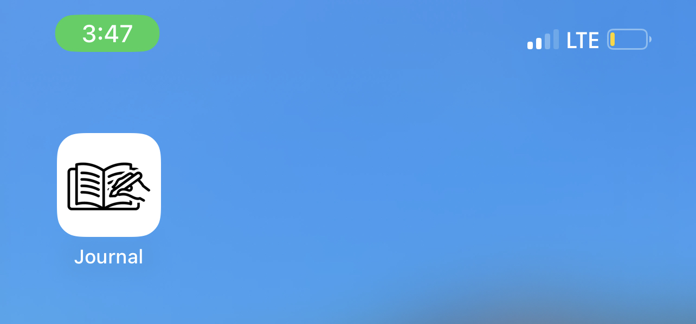
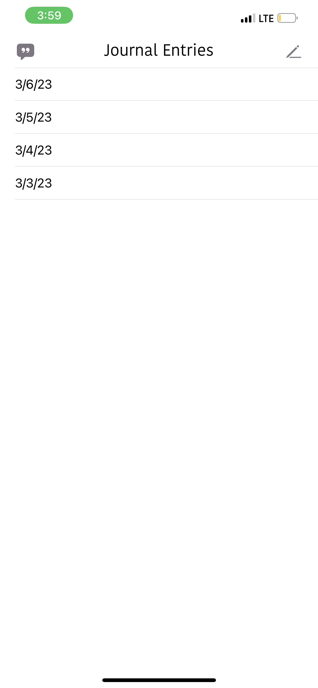
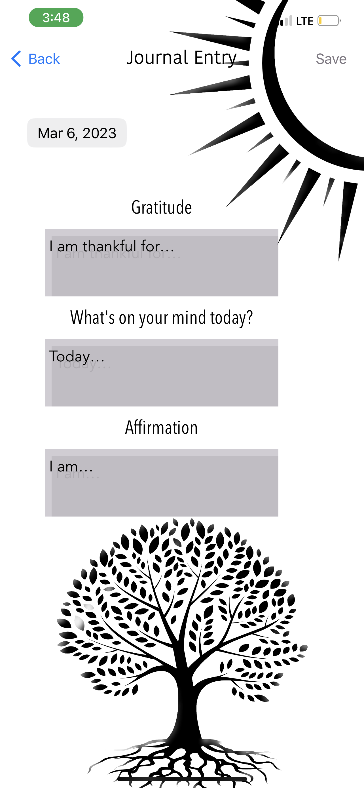

# Journal
==============
Journal is an iOS mobile app designed for users to submit daily journal entries and receive a daily quote. Since the data is saved locally in CoreData, a warning alert appears once when first downloading the app, to warn users that entries will not be saved after deleting the app. Animations appear in two views to create nature-like movements in graphics. 

Technologies
--------------
Swift, CoreData, RestAPI, UIKit

Installation
--------------
Import CoreData 
MVC

Future Improvements
--------------------
CloudKit
Sections for dates based on month and year
Alerts for daily quote
